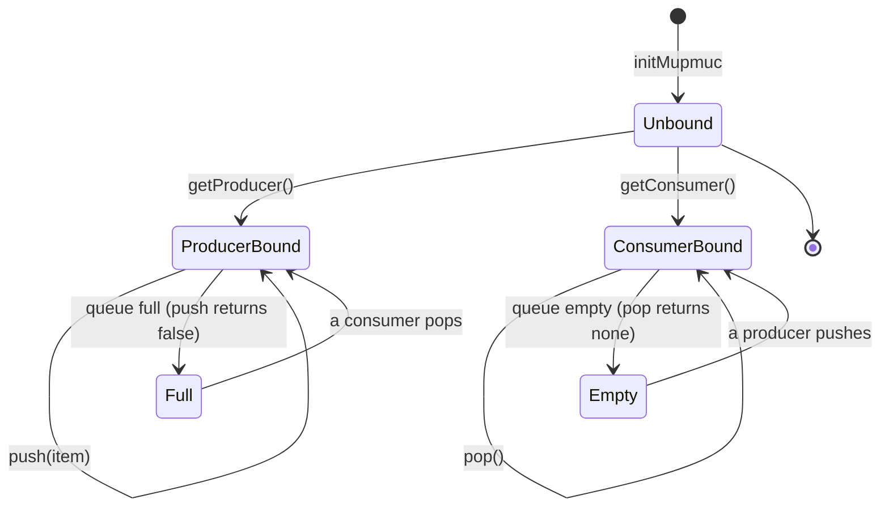

# Mupmuc

Multi-producer, multi-consumer (MPMC) bounded queue. Both pushing and
popping are lock-free.

## Overview

- **Push**: Lock-free (producers coordinate via CAS on `tail` and
  per-slot Vyukov `seq` counters)
- **Pop**: Lock-free (consumers coordinate via CAS on `head` and
  per-slot Vyukov `seq` counters)
- **Capacity**: Fixed at compile time

Mupmuc occupies the MPMC quadrant of the bounded queue family — the
most general bounded variant. Both producers and consumers must
acquire per-thread handles (`MupmucProducer` / `Consumer`) before
issuing operations.

## Usage

```nim
import lockfreequeues

# Capacity 64, max 4 producers, max 4 consumers
var queue = initMupmuc[64, 4, 4, int]()

# Producers must get a handle
var producer = queue.getProducer()
discard producer.push(42)

# Consumers must get a handle
var consumer = queue.getConsumer()
let item = consumer.pop()  # some(42)
```

## Type Parameters

- `N: static int` — Queue capacity (power of 2 recommended)
- `P: static int` — Maximum number of producer threads
- `C: static int` — Maximum number of consumer threads
- `T` — Item type

The full proc/type signatures and per-symbol docs are auto-generated
from source by the `:::` directive at the bottom of this page.

## Example: Fan-In, Fan-Out Pattern

```nim
import lockfreequeues
import options

var queue = initMupmuc[256, 4, 4, int]()

proc producer() {.thread.} =
  var p = queue.getProducer()
  for i in 0..<1000:
    while not p.push(i):
      discard

proc consumer() {.thread.} =
  var c = queue.getConsumer()
  while true:
    let item = c.pop()
    if item.isSome:
      discard
```

## Typestate notes

Both producers and consumers must be bound to a thread before
operating on the queue. Calling `Mupmuc.push()` or `Mupmuc.pop()`
directly raises `InvalidCallDefect`. Use `getProducer()` and
`getConsumer()` to obtain handles. If all `P` producer slots are
taken, `getProducer()` raises `NoProducersAvailableError`; if all
`C` consumer slots are taken, `getConsumer()` raises
`NoConsumersAvailableError`.

The push/pop verbs internally use the Vyukov per-slot `seq` protocol
(see `mpmc_push` / `mpmc_pop` in `src/lockfreequeues/typestates/`),
which carries the producer→consumer and consumer→next-producer
happens-before edges without a separate `committed` flag array.



## See also

- [Safety Model](../guide/safety-model.md) — happens-before
  guarantees, the Vyukov per-slot `seq` protocol, and ordering
  semantics.
- [Slot Ownership Typestates](../guide/slot-ownership-typestates.md) —
  the shared internal state machine across all bounded variants.

::: lockfreequeues/mupmuc
