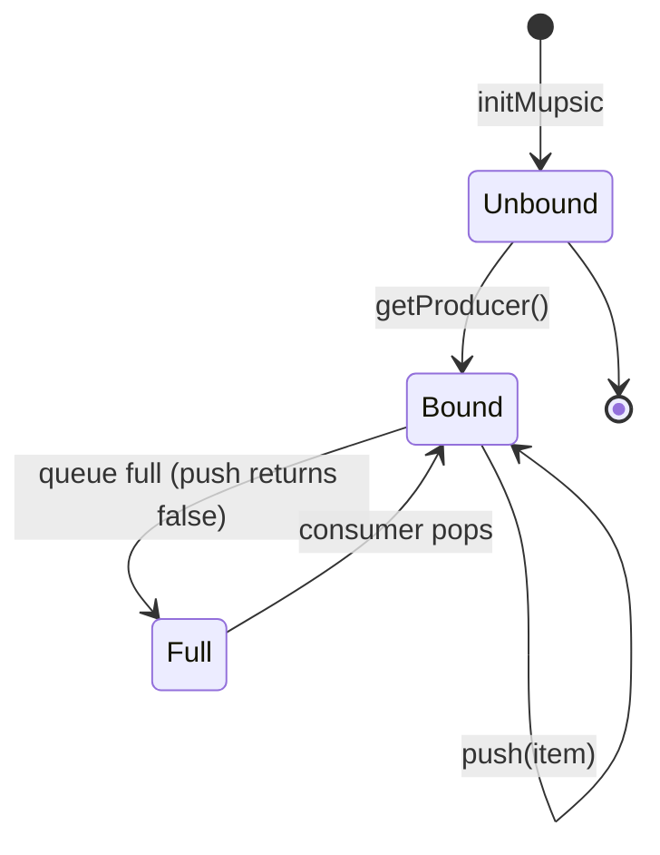

# Mupsic

Multi-producer, single-consumer (MPSC) bounded queue. Pushing is
lock-free across producers; popping is lock-free for the single
consumer (with defensive CAS — see source).

## Overview

- **Push**: Lock-free (producers coordinate via CAS on `tail` and
  per-slot Vyukov `seq` counters)
- **Pop**: Lock-free (single consumer, defensive CAS on `head`)
- **Capacity**: Fixed at compile time

Mupsic occupies the MPSC quadrant of the bounded queue family.
Producers each acquire a `Producer[N, P, T]` handle bound to their
thread (via `getProducer()`), then push through that handle. The
single consumer pops directly on the queue.

## Usage

```nim
import lockfreequeues

# Capacity 64, max 4 producers
var queue = initMupsic[64, 4, int]()

# Producers must get a handle first
var producer = queue.getProducer()
discard producer.push(42)

# Single consumer pops directly
let item = queue.pop()  # some(42)
```

## Type Parameters

- `N: static int` — Queue capacity (power of 2 recommended)
- `P: static int` — Maximum number of producer threads
- `T` — Item type

The full proc/type signatures and per-symbol docs are auto-generated
from source by the `:::` directive at the bottom of this page.

## Example: Fan-In Pattern

```nim
import lockfreequeues
import options

var queue = initMupsic[256, 4, int]()

proc producer() {.thread.} =
  var p = queue.getProducer()
  for i in 0..<1000:
    while not p.push(i):
      discard

proc consumer() {.thread.} =
  while true:
    let item = queue.pop()
    if item.isSome:
      discard
```

## Typestate notes

Producers must be bound to a thread before pushing. Calling
`Mupsic.push()` directly raises `InvalidCallDefect`; use
`getProducer()` to obtain a `Producer[N, P, T]` first. The producer
slot is reclaimed only on queue reset; if all `P` slots are taken,
`getProducer()` raises `NoProducersAvailableError`.

The push/pop verbs internally use the Vyukov per-slot `seq` protocol
(see `mpsc_push` / `mpsc_pop` in `src/lockfreequeues/typestates/`),
which carries the producer→consumer happens-before edge without a
separate `committed` flag array.



## See also

- [Safety Model](../guide/safety-model.md) — happens-before
  guarantees, the Vyukov per-slot `seq` protocol, and ordering
  semantics.
- [Slot Ownership Typestates](../guide/slot-ownership-typestates.md) —
  the shared internal state machine across all bounded variants.

::: lockfreequeues/mupsic
